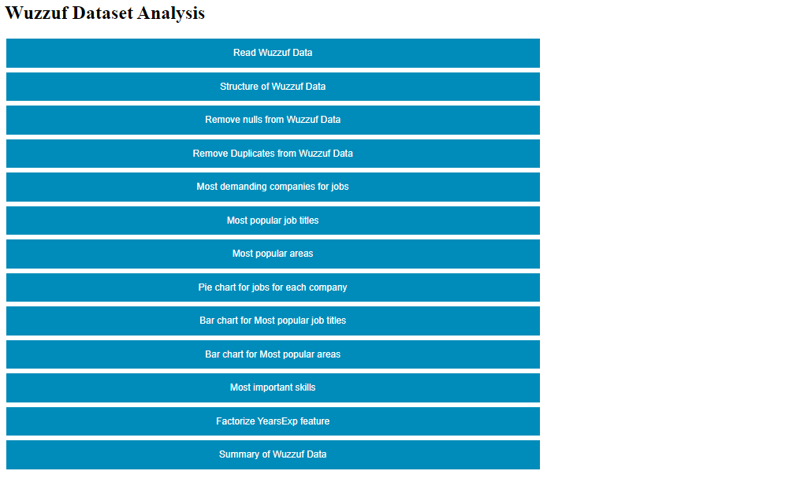

# Java and UML- Final practical Work

### Data Set
Wuzzuf Jobs in Egypt data set at Kaggle

https://www.kaggle.com/omarhanyy/wuzzuf-jobs

### Task

A web service made using spring Framework and Smile to make some data analysis on the Wuzzuf Dataset:

**1- Read the dataset, convert it to DataFrame, and dispay some from it**

````
public WuzzufDAOImp(String path) throws IOException, URISyntaxException {

        CSVFormat format = CSVFormat.DEFAULT.withFirstRecordAsHeader ();
        try
        {
            Data= Read.csv (path, format).select("Title","Company","Location","Type","Level","YearsExp","Country","Skills");


            Data.stream().map(r -> r.getString("Skills")).forEach(x ->
                    Collections.addAll(skills,x.split(",")));
        }

        catch (IOException  | URISyntaxException e)
        {
            e.printStackTrace();
        }
    }

    public String Read_data()
    {
        return Data.slice(0,10).toString();
    }
````

**2.Display structure and summary of the data**
````r
public String Summary()
    {
        
       return Data.summary().toString();
    }
    
 public String WuzzufDataStructure()
    {
        return Data.structure().toString();
    }
   
````

**3.clean the data(null,duplications)**

````r
public String clean()
    {
        return "Number of rows in data= "+ String.valueOf( Data.omitNullRows().nrows()) +
                ", Number of rows after removing null values= " +String.valueOf( Data.nrows()) ;
    }

public long RemoveDuplicates()
    {

        
        try {
            Table t = Table.read().file("src/main/resources/Wuzzuf_Jobs.csv");
            t= t.dropDuplicateRows() ;
            return t.stream().count() ;
        } catch (IOException e) {
            e.printStackTrace();
        }

        return 0;


    }
````

**4.Count the jobs for each company and display that in order 
(What are the most demanding companies for jobs?)**

**6.Find out what are the most popular job titles.**

**8.Find out the most popular areas?**

all this is done using one method, you only need to specify the name of the column

````r
public Map<Long,Object> getCount(String col)
    {

        Map<Object,Long> CompanyJobs= Data.stream().collect(Collectors.groupingBy(t -> t.getString(col), Collectors.counting()));
        TreeMap<Long,Object> DATA = new TreeMap<>();

        for ( Map.Entry<Object,Long> i: CompanyJobs.entrySet())
        {
            if (i.getValue() > 10)
            {

                DATA.put(i.getValue(), i.getKey() );

            }

        }


        return DATA.descendingMap();


    }
````

**5.Show step 4 in a pie chart**
````r
public PieChart DrawPie(Map<Long,Object> data ) throws IOException {

        PieChart chart = new PieChartBuilder().width (800).height (600).title ("Jobs Pie Chart").build ();
       List<String> value=data.values().stream().map(t->t.toString()).collect(Collectors.toList());
       List<Integer> count= data.keySet().stream().map(t-> t.intValue()).collect(Collectors.toList());

       for (int i=0 ;i<value.size();i++)
       {
           chart.addSeries(value.get(i),count.get(i));

       }

        return chart;

    }
````

**7.Show step 6 in bar chart**

**9.Show step 8 in bar chart**

```r
public CategoryChart DrawBar(Map<Long,Object> data , String col1, String col2) throws IOException {

        CategoryChart chart = new CategoryChartBuilder().width (1024).height (768).title ("Most Popular " + col1 +"s" ).xAxisTitle ("Job Titles").yAxisTitle ("Count").build ();
        List<String> value=data.values().stream().map(t->t.toString()).collect(Collectors.toList());
        List<Integer> count= data.keySet().stream().map(t-> t.intValue()).collect(Collectors.toList());

        chart.getStyler ().setLegendPosition (Styler.LegendPosition.InsideNW);
        chart.getStyler ().setHasAnnotations (true);
        chart.getStyler().setXAxisLabelRotation(90);
        chart.addSeries ( col1 + col2 , value, count);

        return chart ;

    }
```

**10.Print skills one by one and how many each repeated and order the output to find out the most important skills required?**
```r
public Map<Integer,String>   count_skills ()

    {

      Map<String ,Integer > m = new TreeMap<>();


      for (String s : skills) {
        if (!(s.equals(null))) {
            if (m.containsKey(s)) {
                m.put(s, m.get(s) + 1);
            } else {
                m.putIfAbsent(s, 1);
            }
        }
      }


      TreeMap<Integer,String> TopSkills = new TreeMap<>();

        for ( Map.Entry<String,Integer> i: m.entrySet())
        {
            if (i.getValue() > 10)
            {

                TopSkills.put(i.getValue(), i.getKey() );

            }

        }


      return TopSkills.descendingMap();
    }
```

**11.Factorize the YearsExp feature and convert it to numbers in new col.**

```r
public String Factorize ()
    {


        List<String> years= Data.select("YearsExp").stream().map(x -> x.getString(0).replace("Yrs of Exp","" )).collect(Collectors.toList());


        List<String> years_distinct= Data.select("YearsExp").stream().map(x -> x.getString(0).replace("Yrs of Exp","" )).distinct().collect(Collectors.toList());


        List<Integer> categories=new ArrayList<>();
        for(String y : years)
        {
            categories.add(years_distinct.indexOf(y));

        }
        Data=Data.merge(IntVector.of( "Years Exp encoded",categories.stream().mapToInt(i->i).toArray()));


        return Data.slice(0,10).toString();
    }
}

```


### Html page
open First Page.html in WuzzufProject




### Demo
https://drive.google.com/file/d/1xMdOfyIewu3_8pogDptsJuJAVB-xKykN/view?usp=sharing


### Team Members:
- Mohand Abdelhalim Ibrahim
- Abdelrahman Tarek Mahmoud
- Afnan Samir Mohamed 
- Esraa Sayed Mostafa

